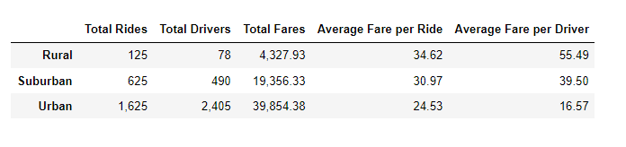
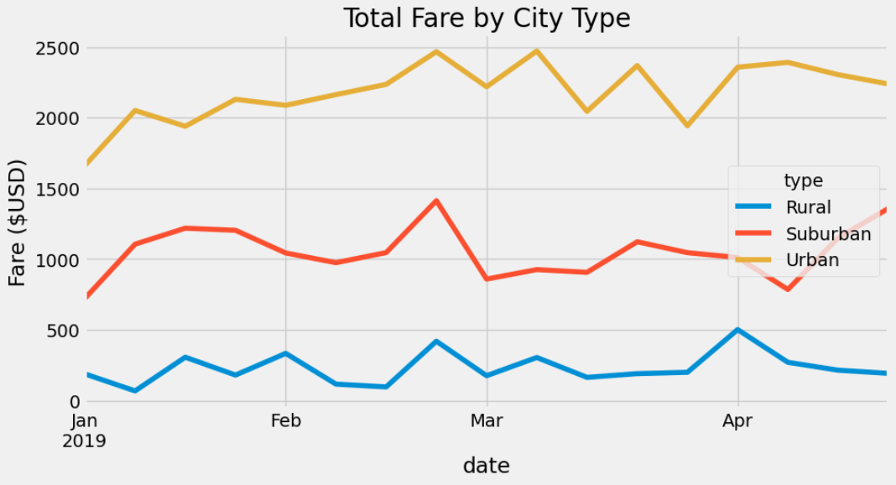

# PyBer_Analysis
## Overview of the analysis:
This analysis is to compare the difference ride-sharing data between city type and help decision makers to make their decision.
## Results:
In this analysis, we could understand that people who live in urban area need more ride-sharing service than others, but rural's unit fare is the most expensive, the fare for each driver is the most expensive as well.
 
(pyber_summary)
By looking the final line chart, we could realize that between february and march has the highset fare in urban and suburban, but in rural the highset fare is in april, and the lowest fare that three type of area have are in around january.
 
(Total_Fare_by_City_Type)
## Summary:
First of all, I suggest that we can hold some festival or concert in rural between march and april to apportion the population from suburban and urban that will  lower the fare in those areas.

Secondly, we can send more drivers to suburban after april to balance the supply and demand it also can lower the fare.

Finally, around january is the low season of the ride-sharing for every type of city. We can also hold some event that relate to the winnter to attract people going outside.